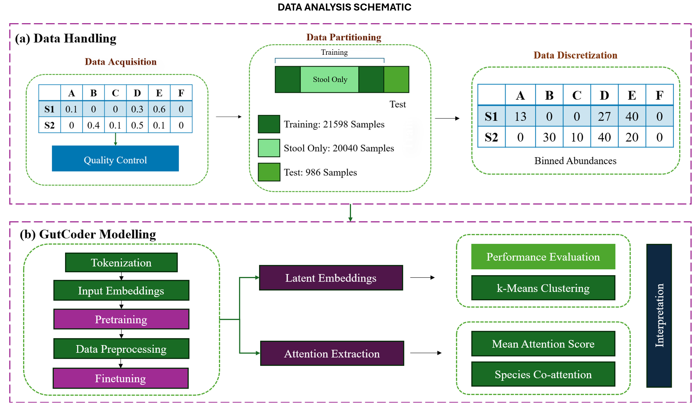
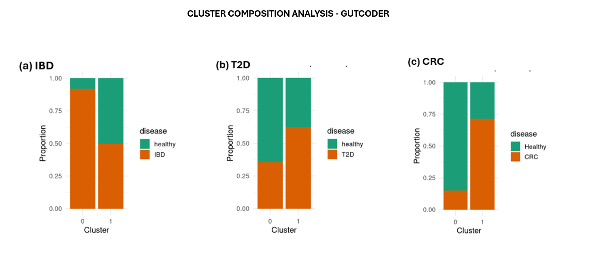

# GutCoder


GutCoder is an attention-based transformer encoder that learns microbial community structure in the gut during healthy and chronic inflammatory disease states from high dimensional, noisy relative abundance data.

## Overview
- GutCoder is extensively pretrained on unlabelled species relative abundance data using a Masked Modelling approach
- It is finetuned on labelled Chronic Inflammatory cohorts - IBD, T2D and CRC to distinguish from healthy conditions
  - Implements Nested Leave-One-Study-Out Cross validation (LOSO-CV) to tune hyperparameters and rigorously evaluate supervised classification tasks with a baseline Multi-Layer Perceptron (MLP)
  - Implements unsupervised k-means clustering to visualize and interpret separation of diseases in the latent embedding space with a traditional Autoencoder
- Mean attention scores and species co-attention is calculated to correlate high attended microbial species with existing literature

## Dataset
Species-relative abundance data from the `curatedMetagenomicData` along with its metadata is used for training GutCoder. 
To do this, first, the `curatedMetagenomicData` package (Version 3.18.0) is installed via Bioconductor:

```r
if (!require("BiocManager", quietly = TRUE))
    install.packages("BiocManager")

BiocManager::install("curatedMetagenomicData")
```
- Total samples: 22584
- Total microbial species (features): 2316

## Configuration
- Number of encoder layers: 2
- Number of heads: 2
- Embedding dimension: 256
- Feedforward dimension: 512

## Methodology


1. **Data Handling**
   - Species relative abundance data is assessed for data integrity
   - Data is partitioned into training and test sets. The training set is further filtered to contain only stool samples.
   - Relative abundance values are transformed to abundance bins in order to handle the compositional nature of the microbiome.
2. **Modelling**
   - Binned abundances are tokenized to reduce vocabulary size and memory consumption
   - Tokens are translated to vector representations called embeddings and this becomes the input to the GutCoder
   - The model is pretrained to learn the overall structure of the (gut)microbiome
   - The pretrained model is finetuned to classify chronic inflammatory states (IBD, T2D, CRC) from healthy states (Nested LOSO-CV)
3. **Evaluation**
   - Primary metric: AUROC
   - A k-means clustering algorithm is implemented on finetuned embeddings
   - Cluster composition analysis is performed to evaluate disease separation
   - Attention analysis to interpret species with highest attention and co-attention.

## Key Results

### Finetuning Performance (Supervised Classification)

| Model | IBD vs Healthy | | T2D vs Healthy | | CRC vs Healthy | |
|-------|---------------|---|---------------|---|---------------|---|
| | CV | Test | CV | Test | CV | Test |
| GutCoder | 0.72 | 0.69 | 0.56 | 0.62 | 0.62| 0.66 |
| MLP | 0.68 | 0.69 | 0.55 | 0.49 | 0.67 | 0.83 |

*AUC scores from nested LOSO-CV. CV = OOF cross-validation AUC; Test = held-out test AUC.*

- Achieves similar performance to standard MLP in the IBD task
- Outperforms standard MLP in the T2D task
- Struggles with the CRC task compared to standard MLP

### Cluster Composition analysis 


## Future work
- Advanced classifiers to improve performance eg., FourierKAN used for text classification
- Improved benchmarks for reliable evaluations
- Community structure across other disease (sub) types

## Citation
Pasolli E, Schiffer L, Manghi P, Renson A, Obenchain V, Truong D, Beghini F, Malik F, Ramos M, Dowd J, Huttenhower C, Morgan M, Segata N, Waldron L (2017). “Accessible, curated metagenomic data through ExperimentHub.” Nat. Methods, 14(11), 1023–1024. ISSN 1548-7091, 1548-7105. doi:10.1038/nmeth.4468.
